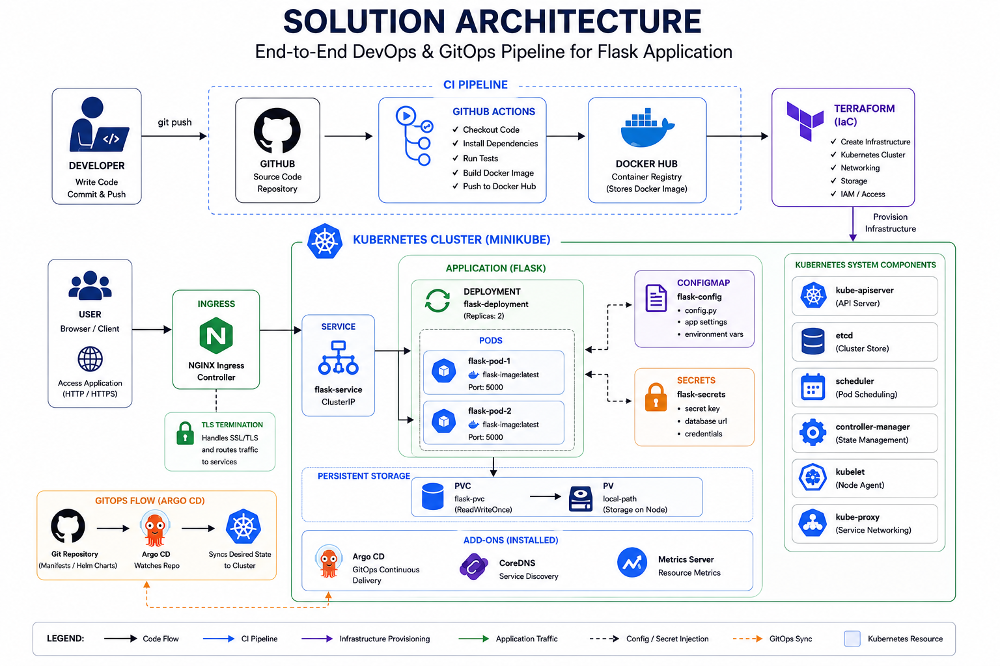
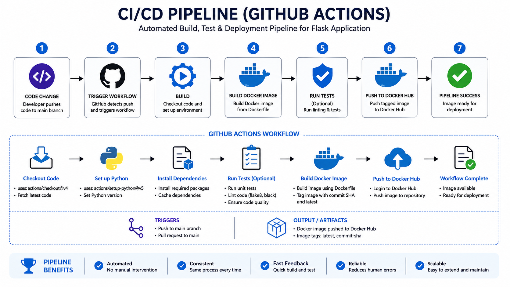
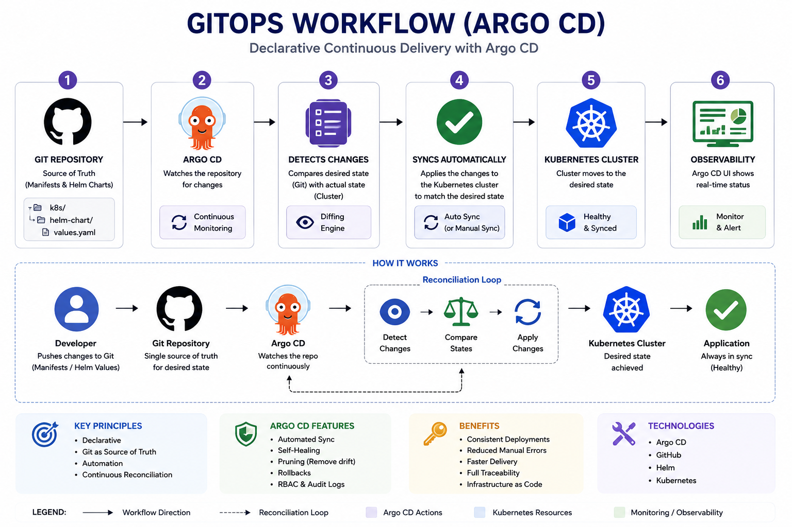
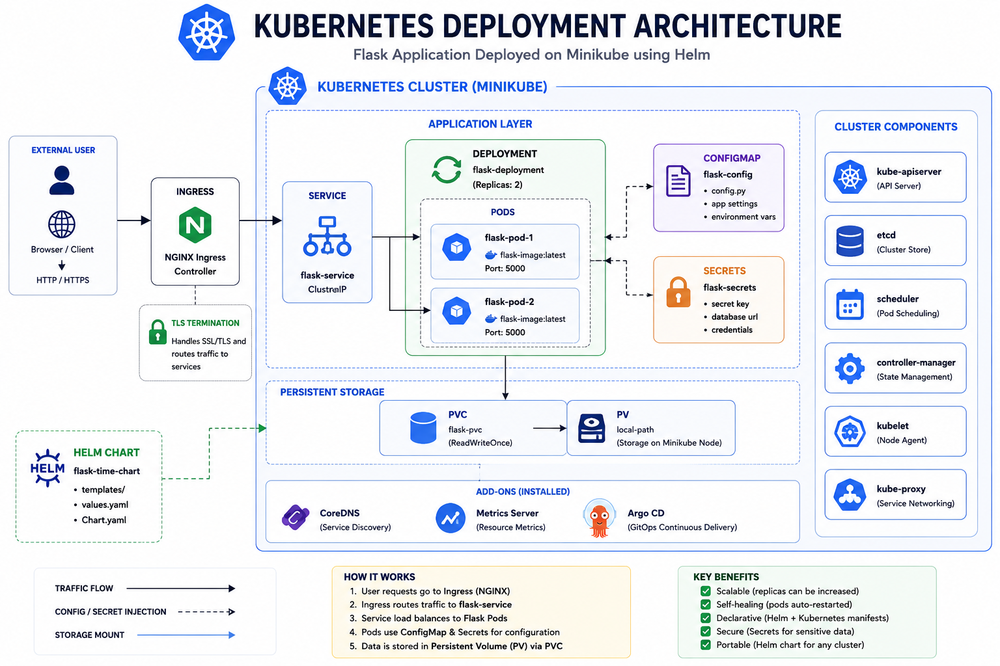
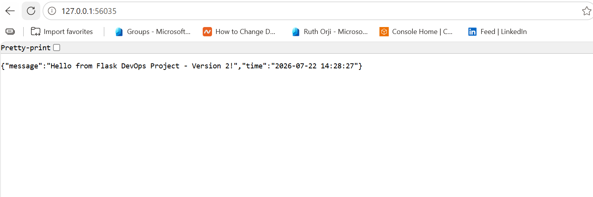
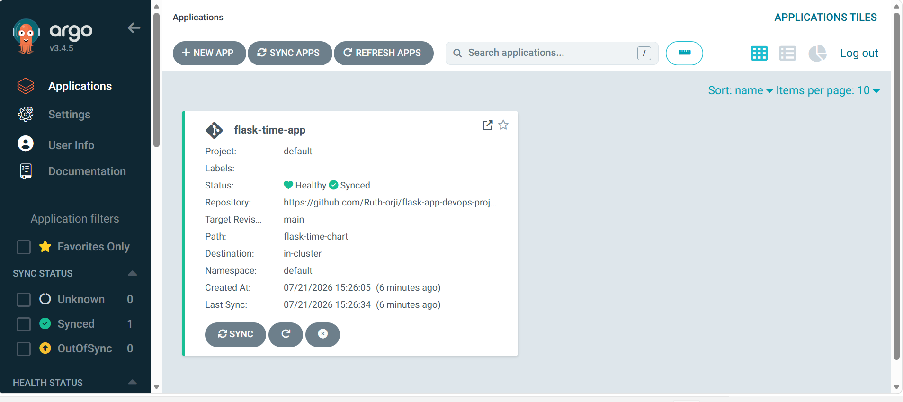
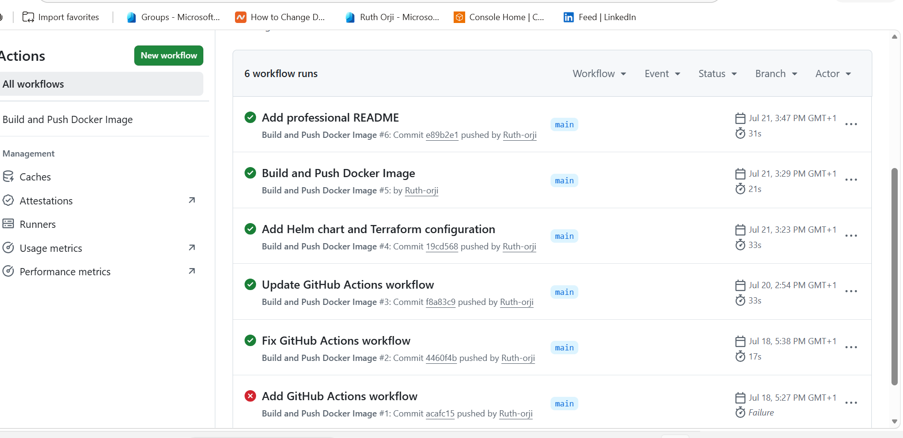

# Flask DevOps Project 🚀

A complete end-to-end DevOps project demonstrating modern CI/CD and GitOps practices using a simple Flask application deployed to Kubernetes.


> **An end-to-end DevOps project demonstrating CI/CD and GitOps by deploying a Flask application to Kubernetes using Docker, GitHub Actions, Terraform, Helm, and Argo CD.**

---

## 📖 Overview

This repository demonstrates a complete DevOps workflow from application development to automated Kubernetes deployment.

## 📑 Table of Contents

- [Overview](#-overview)
- [Features](#-features)
- [Technology Stack](#️-technology-stack)
- [Solution Architecture](#️-solution-architecture)
- [CI/CD Pipeline](#-cicd-pipeline)
- [GitOps Workflow](#-gitops-workflow)
- [Kubernetes Deployment](#-kubernetes-deployment)
- [Project Structure](#-project-structure)
- [Getting Started](#-getting-started)
- [Project Screenshots](#-project-screenshots)
- [Future Improvements](#-future-improvements)
- [Author](#-author)
- [License](#-license)

## ✨ Features

- Containerized Flask application with Docker
- Infrastructure provisioning using Terraform
- Local Kubernetes cluster with Minikube
- Helm chart for Kubernetes deployments
- Continuous Integration using GitHub Actions
- GitOps continuous deployment with Argo CD
- Docker Hub image publishing
- End-to-end DevOps workflow

# 🛠️ Technology Stack

| Category | Technology |
|----------|------------|
| Language | Python |
| Framework | Flask |
| Containerization | Docker |
| Container Registry | Docker Hub |
| CI/CD | GitHub Actions |
| Infrastructure as Code | Terraform |
| Container Orchestration | Kubernetes (Minikube) |
| Kubernetes Package Manager | Helm |
| GitOps | Argo CD |
| Version Control | Git & GitHub |

## 🏗️ Solution Architecture

The diagram below illustrates the complete DevOps workflow, showing how application code flows from development through CI/CD and GitOps into a Kubernetes cluster.

<p align="center">
  
</p>

## 🔄 CI/CD Pipeline

The CI/CD pipeline automatically builds and publishes a Docker image to Docker Hub whenever changes are pushed to the `main` branch using GitHub Actions.

<p align="center">
  
</p>

## ☸️ GitOps Workflow

Argo CD continuously monitors the GitHub repository and synchronizes the Kubernetes cluster with the desired state stored in Git.

<p align="center">
  
</p>

## ☸️ Kubernetes Deployment

This diagram illustrates how Kubernetes components work together to deploy and expose the Flask application inside the Minikube cluster.

<p align="center">
  
</p>

## 📂 Project Structure

```text
flask-app-devops-project/
│
├── .github/
│   └── workflows/
│       └── docker.yml
│
├── docs/
│   ├── diagrams/
│   └── screenshots/
│
├── flask-time-chart/
│
├── terraform/
│
├── app.py
├── Dockerfile
├── README.md
└── .gitignore
```
## 📋 Prerequisites

Before running this project, ensure you have installed:

- Git
- Docker Desktop
- Minikube
- kubectl
- Helm
- Terraform
- A GitHub account

## 🚀 Getting Started

### Clone the repository

```bash
git clone https://github.com/Ruth-orji/flask-app-devops-project.git
cd flask-app-devops-project
```

### Build Docker image

```bash
docker build -t flask-time-app .
```

### Start Minikube

```bash
minikube start
```

### Deploy using Helm

```bash
helm install flask-time flask-time-chart
```
### Verify the deployment

```bash
kubectl get pods
kubectl get services
```

### Access the application

```bash
minikube service flask-time-service
```

### Deploy with Argo CD

Create an application in the Argo CD UI and point it to this repository.

## 📸 Project Screenshots

### Flask Application

<p align="center">
  
</p>

### Argo CD Dashboard

<p align="center">
  
</p>

### GitHub Actions

<p align="center">
  
</p>

## 🚀 Future Improvements

- Deploy to Amazon EKS
- Provision AWS infrastructure with Terraform
- Store Docker images in Amazon ECR
- Implement monitoring with Prometheus and Grafana
- Add centralized logging with the ELK Stack
- Configure HTTPS using an Ingress Controller

## 👩‍💻 Author

**Ruth Orji**  
Cloud & DevOps Engineer

- **GitHub:** [Ruth-orji](https://github.com/Ruth-orji)
- **LinkedIn:** [Ruth Orji](https://www.linkedin.com/in/RUTH ORJI)


## 📄 License

This project is intended for educational and portfolio purposes.