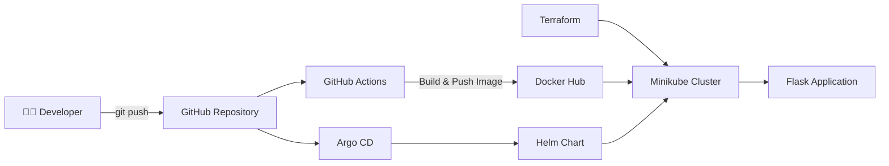
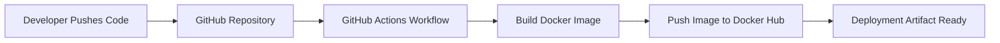
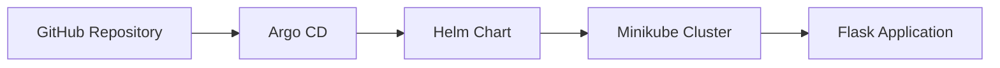

# Flask DevOps Project 🚀

A complete end-to-end DevOps project demonstrating modern CI/CD and GitOps practices using a simple Flask application deployed to Kubernetes.


> **An end-to-end DevOps project demonstrating CI/CD and GitOps by deploying a Flask application to Kubernetes using Docker, GitHub Actions, Terraform, Helm, and Argo CD.**

---

## 📖 Overview

This repository demonstrates a complete DevOps workflow from application development to automated Kubernetes deployment.

## 🏗️ Solution Architecture


---

# 🔄 CI/CD Pipeline

This project uses **GitHub Actions** to automatically build and publish a Docker image whenever code is pushed to the `main` branch.



---

# ☸️ GitOps Workflow

Argo CD continuously monitors the GitHub repository and synchronizes Kubernetes with the desired state stored in Git.



---

# 📂 Project Structure

```text
flask-app-devops-project/
│
├── .github/
│   └── workflows/
│       └── docker.yml
│
├── flask-time-chart/
│   ├── templates/
│   ├── Chart.yaml
│   └── values.yaml
│
├── terraform/
│   ├── backend.tf
│   ├── provider.tf
│   ├── main.tf
│   └── variables.tf
│
├── app.py
├── Dockerfile
├── README.md
└── .gitignore
```

---

# 🛠️ Technology Stack

| Category | Technology |
|----------|------------|
| Language | Python |
| Framework | Flask |
| Containerization | Docker |
| Container Registry | Docker Hub |
| CI/CD | GitHub Actions |
| Infrastructure as Code | Terraform |
| Container Orchestration | Kubernetes (Minikube) |
| Kubernetes Package Manager | Helm |
| GitOps | Argo CD |
| Version Control | Git & GitHub |

## 🏗️ Solution Architecture


## 🔄 CI/CD Pipeline


## ☸️ GitOps Workflow


## 🚀 Kubernetes Deployment


<h2>🏗️ Solution Architecture</h2>

<p align="center">
  
</p>

<h2>🔄 CI/CD Pipeline</h2>

<p align="center">
  
</p>

<h2>🔄 Gitops Workflow</h2>

<p align="center">
  
</p>

<h2>🔄 Kubernetes Deployment</h2>

<p align="center">
  
</p>

## 📄 License

This project is intended for educational and portfolio purposes.
